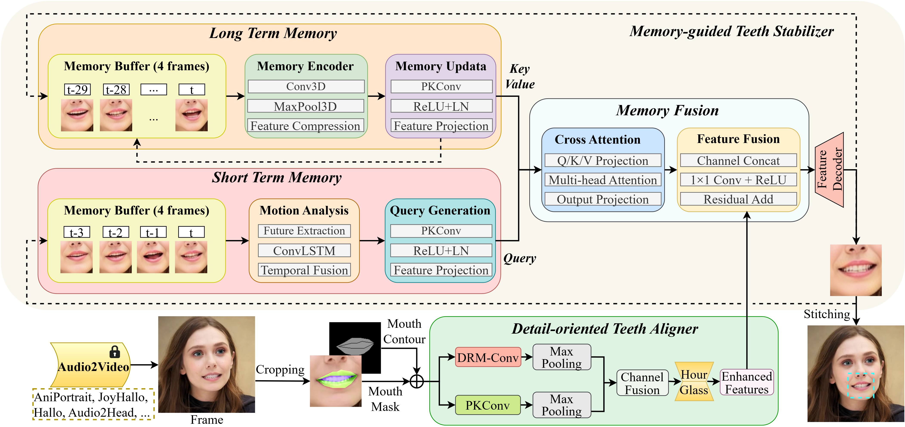

# OrthoNet: Outstanding Orthodontist for Talking Face Synthesis  

> **No More Artifactual Teeth in Talking Face Generation**  
> Official implementation of the paper: *Outstanding Orthodontist: No More Artifactual Teeth in Talking Face* (Su et al., 2025)  

---

## ✨ Overview  

Audio-driven talking face synthesis (TFS) enables generating realistic speaking videos from a single portrait image and a speech audio clip.  
However, existing methods often struggle with **temporal inconsistency and artifacts in the teeth region**, leading to unnatural results.  

We propose **OrthoNet**, a **plug-and-play framework** that works as a *virtual orthodontist* for existing Audio2Video methods.  

**Key Contributions:**  
- 🦷 **Detail-oriented Teeth Aligner** — Preserves teeth details and adapts to shape changes during lip movements.  
- 🧠 **Memory-guided Teeth Stabilizer** — Combines long-term and short-term memory to ensure temporal consistency.  
- 🔌 **Plug-and-Play** — Can be integrated with existing talking face models (e.g., AniPortrait, Audio2Head, Hallo2).  
- 🎥 **Improved Realism** — Eliminates hallucinations, preserves teeth edges, and maintains stability under occlusion.  

---

## 🏗 Framework  

  
    

  

*Figure: OrthoNet consists of two main modules — the Detail-oriented Teeth Aligner (dual-branch DRM-Conv + PKConv) and the Memory-guided Teeth Stabilizer (LTM + STM with cross-attention).*  

---

### Visual Comparisons  

  
    

  

*Figure: Comparison between baseline methods (green box) and OrthoNet-enhanced results (red box). Our method significantly improves teeth stability and realism under different occlusion conditions.*  

---

## 🎬 Demo Videos  

Here we showcase demo results of OrthoNet applied to various baselines:  

  

  <figcaption style="font-weight: bold;">
    ◀ Left: Hallo2
    &nbsp;|&nbsp;
    Right: Hallo2 + Ours ▶
  </figcaption>

  

  <figcaption style="font-weight: bold;">
    ◀ Left: JoyHallo
    &nbsp;|&nbsp;
    Right: JoyHallo + Ours ▶
  </figcaption>

  

  <figcaption style="font-weight: bold;">
    ◀ Left: AniPortrait
    &nbsp;|&nbsp;
    Right: AniPortrait + Ours ▶
  </figcaption>

  

  <figcaption style="font-weight: bold;">
    ◀ Left: Audio2Head
    &nbsp;|&nbsp;
    Right: Audio2Head + Ours ▶
  </figcaption>

  

  <figcaption style="font-weight: bold;">
    ◀ Left: EchoMimic
    &nbsp;|&nbsp;
    Right: EchoMimic + Ours ▶
  </figcaption>

## Acknowledgments
Parts of this project page were adopted from the [Nerfies](https://nerfies.github.io/) page.

## Website License
 This work is licensed under a <a rel="license" href="http://creativecommons.org/licenses/by-sa/4.0/">Creative Commons Attribution-ShareAlike 4.0 International License</a>.
